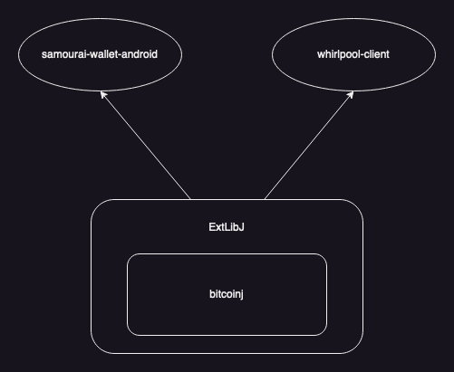

[](https://jitpack.io/#io.samourai.code.wallet/ExtLibJ)

# ExtLibJ
BitcoinJ extensions: BIP39/44/47/49/69/84/86/125/141/340, bech32, bech32m, PSBT (BIP174).

Samourai toolkit.

See [documentation](README-DOC.md)




## Build
Build with Maven:
```
mvn clean install -Dmaven.test.skip=true
```

Build & Run JUnit Tests with Maven:
```
mvn clean install
```


## Run JUnit Tests
Run JUnit Tests with Maven:
```
mvn clean test
```

Run JUnit Test Class with Maven:
```
mvn clean test -Dtest=xxxxTest
```

Run JUnit Test Classes with Maven:
```
mvn clean test -Dtest=xxxxTest1,xxxxTest2
```

Run JUnit Test Method with Maven:
```
mvn clean test -Dtest=xxxxTest#testA
```

Run JUnit Test Methods with Maven:
```
mvn clean test -Dtest=xxxxTest#testA+testB
```

<br />


## Features

### BIP39:

Samourai implementation based on [original BIP](https://github.com/bitcoin/bips/blob/master/bip-0039.mediawiki), extends [bitcoinj](https://bitcoinj.github.io/).

### BIP44:

Samourai implementation based on [original BIP](https://github.com/bitcoin/bips/blob/master/bip-0044.mediawiki), extends [bitcoinj](https://bitcoinj.github.io/).

### BIP47:

Samourai implementation based on [original BIP](https://github.com/bitcoin/bips/blob/master/bip-0047.mediawiki) by Justus Ranvier. Extends BIP44 implementation (above). Further modifications have been made to incorporate Segwit addresses into BIP47.

[BIP47 Source Code](https://code.samourai.io/wallet/ExtLibJ/-/tree/develop/java/com/samourai/wallet/bip47)

[BIP47 Tests](https://gist.github.com/SamouraiDev/6aad669604c5930864bd)

### BIP49 (Segwit):

Samourai P2SH-P2WPKH implementation based on [original BIP](https://github.com/bitcoin/bips/blob/master/bip-0049.mediawiki) by Daniel Weigl and includes support for BIP49-specific XPUBs: [YPUB](https://github.com/Samourai-Wallet/sentinel-android/issues/16).

### BIP69:

Samourai implementation based on [original BIP](https://github.com/bitcoin/bips/blob/master/bip-0069.mediawiki) by Kristov Atlas.

### BIP84 (Segwit):

Samourai implementation based on [original BIP](https://github.com/bitcoin/bips/blob/master/bip-0084.mediawiki) by Pavol Rusnak.

### BIP125 (Replace-by-fee, RBF):

Samourai implementation based on [original BIP](https://github.com/bitcoin/bips/blob/master/bip-0125.mediawiki) by David A. Harding and Peter Todd.

### BIP141 (Segwit):

Samourai spends to bech32 addresses P2WPKH based on [original BIP](https://github.com/bitcoin/bips/blob/master/bip-0141.mediawiki) by Eric Lombrozo, Johnson Lau and Pieter Wuille.

### BIP173 (Segwit):

Samourai implementation based on [original BIP](https://github.com/bitcoin/bips/blob/master/bip-0173.mediawiki) by Pieter Wuille and Greg Maxwell.

### BIP174 (Partially Signed Bitcoin Transaction Format, PSBT):

Samourai signing via PSBT implementation based on [original BIP](https://github.com/bitcoin/bips/blob/master/bip-0174.mediawiki) by  Andrew Chow.

<br />

### Spending:

Samourai spends include the possibility of including custom fees as well as the use of batch spending (build up a list of batched outputs for grouped spend and fee savings).

### Ricochet:

Samourai implementation of multi-hop spend designed to outrun the baying pack of #KYCRunningDogs.

Ricochet using nLockTime (staggered) will spread out hops over different blocks and make sure that hops do not appear all at once in the mempool.

### STONEWALL:

STONEWALL spend is designed to increase the number of combinations between inputs and outputs (transaction entropy). It replaces the previously used BIP126. The objective is to obtain a positive entropy score using [Boltzmann](https://code.samourai.io/oxt/boltzmann) evaluation of the transaction.

### STONEWALLx2:

STONEWALL spend is a 2-person collaborative coinjoin spend carried out with another user. It is indistinguishable from a regular STONEWALL. Manually coordinate with QR codes or automatically coordinate with [Soroban](https://code.samourai.io/wallet/soroban-client-java) over Tor. See [doc/cahoots](doc/cahoots/README.md).


### Stowaway:

A Stowaway spend, also known as a [PayJoin](https://en.bitcoin.it/wiki/PayJoin), is a collaborative-spend carried out with another user. UTXOs are joined and the spend amount is cloaked. Manually coordinate with QR codes or automatically coordinate with [Soroban](https://code.samourai.io/wallet/soroban-client-java) over Tor. It is based on an [idea](https://bitcointalk.org/index.php?topic=139581.0) by Gregory Maxwell. See [doc/cahoots](doc/cahoots/README.md).

### TestNet3:

MainNet/TestNet options available.

## Contributing

We're always looking to polish and make improvements. Help us make Swaps better!

1. Fork it (`git clone https://code.samourai.io/wallet/ExtLibJ.git`)
2. Create your feature branch (`git checkout -b my-new-feature`)
3. Commit your changes (`git commit -am 'Add some feature'`)
4. Push to the branch (`git push origin my-new-feature`)
5. Create new Merge Request with `devlop` branch

[How to Fork an Open Source Project](https://bitcoiner.guide/fork/)

## License

[GNU General Public License 3](https://code.samourai.io/wallet/ExtLibJ/-/blob/develop/LICENSE-ExtLibJ)


