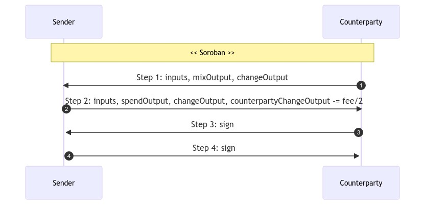

# STONEWALLX2

## I. Usage
- Spender spends to external destination
- Counterparty mixes utxos
- Miner fee shared between spender & counterparty

See [Stonewallx2Example.java](https://code.samourai.io/wallet/ExtLibJ/-/blob/develop/src/test/java/examples/Stonewallx2Example.java)

## II. Cahoots dialog
See [Stonewallx2Service.java](https://code.samourai.io/wallet/ExtLibJ/-/blob/develop/java/com/samourai/wallet/cahoots/stonewallx2/Stonewallx2Service.java)

#### Step #0: SENDER
Initialize:
- ts: timestamp
- strID: unique identifier
- account: sender account to spend
- fingerprint: sender fingerprint
- type: STONEWALLX2
- params: "testnet" or null

Set:
- step: 0
- spendAmount: amount to spend
- strDestination: destination receiving funds
- paynymDestination: destination's paynym (if any)

#### Step #1: COUNTERPARTY
Initialize:
- counterpartyAccount: counterparty account to spend (context.account)
- fingerprintCollab: counterparty fingerprint

Select counterparty inputs to spend:
- value: >= spendAmount + Dust
- from: counterpartyAccount, SEGWIT_NATIVE
- random selection

Generate the mix output:
- value: spendAmount
- to: counterpartyAccount, change, same BipFormat as strDestination

Generate the change output:
- value: sum(counterparty inputs) - mix output value
- to: counterpartyAccount, change, SEGWIT_NATIVE

Set:
- step: 1
- collabChange: change output address
- outpoints: append inputs
- psbt: append inputs + mixOutput + changeOutput

#### Step #2: SENDER

Select sender inputs to spend:
- value >= spendAmount + Dust + minerFee
- from: account, change, SEGWIT_NATIVE
- random selection

Generate the change output:
- value: sum(sender inputs) - spendAmount - feeAmount/2
- to: account, change, SEGWIT_NATIVE

Generate the spend output:
- value: spendAmount
- to: strDestination

Set:
- step: 2
- outpoints: append inputs
- feeAmount: total miner fee (as pair number)
- psbt: 
    * append spendOutput + changeOutput
    * update counterparty change output: deduce feeAmount/2

#### Step #3: COUNTERPARTY

Verify:
- 0 < counterparty spend amount <= feeAmount/2

Set: 
- step: 3
- psbt: 
    * order inputs & outputs with Bip69
    * sign counterparty inputs

#### Step #4: SENDER
Verify:
- 0 < sender spend amount <= amount + feeAmount/2

Set: 
- step: 4
- psbt: 
    * sign sender inputs