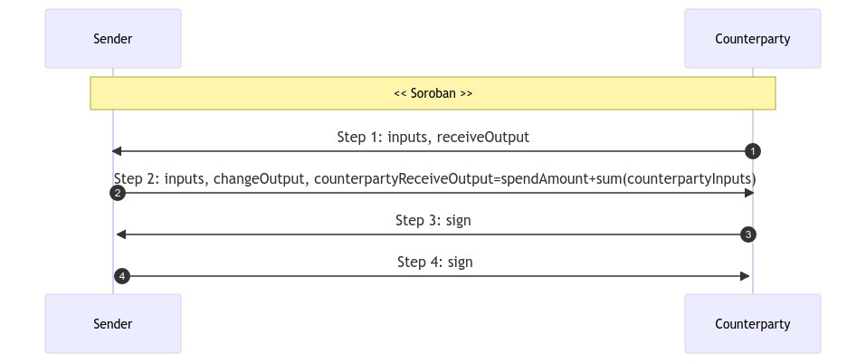

# STOWAWAY

## I. Usage
- Spender spends to counterparty
- Counterparty mixes utxos
- Miner fee shared between spender & counterparty
- Spend amount is obfuscated

See [StowawayExample.java](https://code.samourai.io/wallet/ExtLibJ/-/blob/develop/src/test/java/examples/StowawayExample.java)

## II. Cahoots dialog
See [StowawayService.java](https://code.samourai.io/wallet/ExtLibJ/-/blob/develop/java/com/samourai/wallet/cahoots/stowaway/StowawayService.java)

#### Step #0: SENDER
Initialize:
- ts: timestamp
- strID: unique identifier
- account: sender account to spend
- fingerprint: sender fingerprint
- type: STONEWALLX2
- params: "testnet" or null

Set:
- step: 0
- spendAmount: amount to spend

#### Step #1: COUNTERPARTY
Initialize:
- counterpartyAccount: counterparty account to spend (context.account)
- fingerprintCollab: counterparty fingerprint

Select counterparty inputs to spend:
- value: >= spendAmount + Dust
- from: counterpartyAccount, SEGWIT_NATIVE
- random selection
- single utxo when possible

Generate the receive output:
- value: spendAmount
- to: DEPOSIT (always), receive, SEGWIT_NATIVE

Set:
- step: 1
- outpoints: append inputs
- psbt: append inputs + receiveOutput

#### Step #2: SENDER

Select sender inputs to spend:
- value >= spendAmount + Dust + minerFee
- from: account, SEGWIT_NATIVE
- random selection
- multiple utxo when possible

Generate the change output:
- value: sum(sender inputs) - spendAmount - feeAmount
- to: account, change, SEGWIT_NATIVE

Set:
- step: 2
- outpoints: append inputs
- feeAmount: total miner fee
- psbt: 
    * append change output
    * update counterparty receive output: spendAmount + sum(counterparty inputs)

#### Step #3: COUNTERPARTY

Verify:
- counterparty spend amount == 0 (receives money)

Set: 
- step: 3
- psbt: 
    * order inputs & outputs with Bip69
    * sign counterparty inputs

#### Step #4: SENDER
Verify:
- 0 < sender spend amount <= amount + feeAmount

Set: 
- step: 4
- psbt: 
    * sign sender inputs